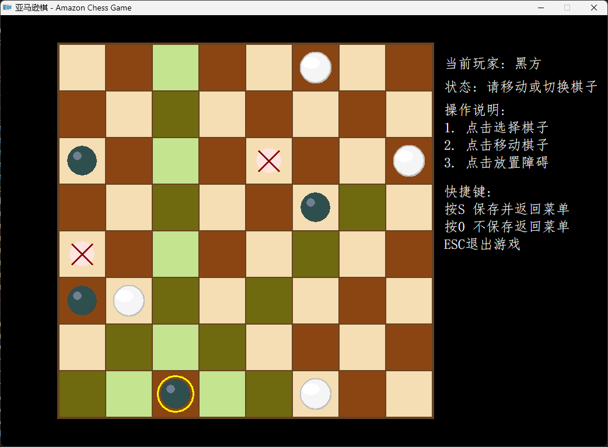

# Amazons（亚马逊棋）

基于 C++17 和 EGE 图形库的亚马逊棋（Game of the Amazons）桌面游戏。
支持人人对战、人机对战（三级 AI 难度），具备完整图形界面和存档系统。

---

## 效果图

<p align="center">
  
</p>

---

## 目录

- [游戏规则](#游戏规则)
- [快速上手](#快速上手)
- [从源码编译](#从源码编译)
- [操作说明](#操作说明)
- [AI 系统](#ai-系统)
- [项目结构](#项目结构)
- [跨平台设计](#跨平台设计)
- [常见问题](#常见问题)

---

## 游戏规则

### 什么是亚马逊棋

亚马逊棋（Game of the Amazons）由阿根廷人 Walter Zamkauskas 于 1988 年发明。它融合了国际象棋皇后的走法和围棋的围地思想 —— 规则很简单，但策略深度极高。

> 本项目采用 **8x8 棋盘**变体（标准比赛为 10x10），节奏更快，适合快速对弈。

### 你需要知道的概念

- **皇后 (Amazon)**：每方有 4 枚，走法与国际象棋皇后相同 —— 沿八个方向（水平、垂直、对角线）走任意格数，但不能跳过任何棋子或障碍
- **障碍箭 (Arrow)**：每个回合结束后射出一支箭，落在空格上后永久占据该格，阻挡所有皇后通行
- **回合 (Turn)**：一个回合 = 移动一枚己方皇后 + 射出一支箭。两步缺一不可

八个移动方向：

```
   ↖  ↑  ↗
   ←  .  →
   ↙  ↓  ↘
```

### 初始布局

```
     0   1   2   3   4   5   6   7
   +---+---+---+---+---+---+---+---+
0  |   |   | B |   |   | W |   |   |
   +---+---+---+---+---+---+---+---+
1  |   |   |   |   |   |   |   |   |
   +---+---+---+---+---+---+---+---+
2  | B |   |   |   |   |   |   | W |
   +---+---+---+---+---+---+---+---+
3  |   |   |   |   |   |   |   |   |
   +---+---+---+---+---+---+---+---+
4  |   |   |   |   |   |   |   |   |
   +---+---+---+---+---+---+---+---+
5  | B |   |   |   |   |   |   | W |
   +---+---+---+---+---+---+---+---+
6  |   |   |   |   |   |   |   |   |
   +---+---+---+---+---+---+---+---+
7  |   |   | B |   |   | W |   |   |
   +---+---+---+---+---+---+---+---+
```

- **B = 黑方皇后**，位于 (0,2) (2,0) (5,0) (7,2)
- **W = 白方皇后**，位于 (0,5) (2,7) (5,7) (7,5)
- **黑方先手**

### 一个完整的回合

假设你是黑方，轮到你的回合：

**第一步：移动一枚皇后**

选中你的一枚皇后，沿八个方向之一走任意格数，落在一个空格上。路径上必须全是空格。

```
移动前：                移动后：
  .  B  .  .              .  .  .  .
  .  .  .  .              .  .  .  .
  .  .  .  .     -->      .  .  .  B     黑方皇后从 (0,1)
  .  .  .  .              .  .  .  .     沿右下方向走 2 格到(2,3)
  .  .  .  .              .  .  .  .
```

**第二步：射出障碍箭**

从皇后的新位置出发，沿八个方向之一射出一支箭。箭沿直线飞行，落在某个空格上（可以是皇后离开前的位置），永久占据该格。

```
射箭前：                射箭后：
  .  .  .  .              .  .  .  X
  .  .  .  .              .  .  .  .
  .  .  .  B     -->      .  .  .  B     从新位置向上射箭
  .  .  .  .              .  .  .  .     障碍落在 (0,3)
  .  .  .  .              .  .  .  .
```

> 箭落下后，该回合结束，轮到对手。`X` 表示障碍。

### 胜负判定

当轮到某一方行动时，如果该方的**全部 4 枚皇后都无法移动**（所有可达空格均被棋子或障碍占据），则该方**落败**，对手获胜。

```
终局示例（白方视角）：

  .  X  W  X  .  X  .  .
  X  X  X  X  X  .  .  .
  X  X  X  X  .  .  .  .
  X  W  X  X  .  .  .  .
  X  W  W  X  .  .  .  .      白方 4 枚皇后 (W)
  X  X  X  X  .  .  .  .      全部被障碍 (X) 堵死
  .  .  .  .  .  .  .  .      --> 白方无路可走，黑方获胜
  .  .  .  .  .  .  .  .
```

核心策略：在保证自己皇后有路可走的同时，用箭逐步封锁对手的活动空间。棋盘可用空间越来越少，终有一方先被堵死。

### 规则速查

| 项目 | 内容 |
|------|------|
| 棋盘 | 8x8 |
| 每方棋子 | 4 枚皇后 |
| 皇后走法 | 八方向，任意格数，路径上不得有棋子或障碍 |
| 回合流程 | ① 移动皇后 → ② 射出障碍箭 |
| 胜利条件 | 对手无法移动任何皇后 |
| 先手 | 黑方 |

---

## 快速上手

### 直接运行（无需编译）

1. 前往 [Releases](https://github.com/Richardwongyk/AmazonChess/releases) 下载最新版 `Amazons.zip`
2. 解压到任意文件夹，确保 `Amazons-local.exe` 和 `music.wav` 在同一目录
3. 双击 `Amazons-local.exe` 即可开始

> 仅需 64 位 Windows（7 / 10 / 11）。程序为静态链接，不需要安装 MinGW 或任何运行时库。

### 从源码编译

**前提**：安装 MinGW-w64（GCC 8 ~ 15 均可），`g++.exe` 和 `mingw32-make.exe` 在系统 PATH 中。

> 没有 MinGW？推荐 [winlibs.com](https://winlibs.com/)（解压即用）或 [MSYS2](https://www.msys2.org/)。

```bash
git clone https://github.com/Richardwongyk/AmazonChess.git
cd AmazonChess
mingw32-make
./Amazons-local.exe
```

CMake 用户：

```bash
mkdir build && cd build
cmake -G "MinGW Makefiles" ..
mingw32-make
../Amazons-local.exe
```

编译选项：`C++17` · `-O2` 优化 · 静态链接 · 12 MB 栈空间（AI 递归搜索需要）

---

## 操作说明

### 主菜单

| 按键 | 功能 |
|------|------|
| `A` | 新游戏 |
| `B` | 载入存档 |
| `C` / `ESC` | 退出游戏 |

### 模式选择

| 按键 | 模式 |
|------|------|
| `1` | 人人对战（两人共用一台电脑） |
| `2` | 人机对战 —— 你执黑（先手） |
| `3` | 人机对战 —— 你执白（后手） |
| `0` | 返回主菜单 |

### 难度选择（人机模式）

| 按键 | 难度 | AI 算法 | 思考时间 |
|------|------|---------|---------|
| `A` | 简单 | 随机走子 | < 0.01 秒 |
| `B` | 中等 | Minimax 搜索 | ~0.1 秒 |
| `C` | 困难 | MCTS 蒙特卡洛搜索 | ~1 秒 |

### 对局操作（三阶段）

每回合使用**鼠标左键**完成三步操作：

| 阶段 | 操作 | 高亮颜色 |
|------|------|---------|
| ① 选子 | 点击己方皇后 | **绿色** = 可走到的格子 |
| ② 走子 | 点击绿色高亮格 | **青色** = 可放箭的格子 |
| ③ 放箭 | 点击青色高亮格 | 障碍落下，回合结束 |

> 在①②阶段可以点击其他己方皇后来切换选择。

### 快捷键

| 按键 | 对局中 | 存档界面 | 游戏结束 |
|------|--------|---------|---------|
| `S` | 保存并回菜单 | — | — |
| `0` | 放弃回菜单 | 返回菜单 | 返回菜单 |
| `ESC` | 退出程序 | 退出程序 | 退出程序 |
| `Delete` | — | 清空全部存档 | — |

---

## AI 系统

AI 引擎在 `AI_Kernel.cpp` 中，与图形界面完全解耦 —— 仅接受棋盘数组即可返回走法。

### 简单（随机算法）

枚举所有合法走法，均匀随机选择一个。没有任何策略成分，适合熟悉规则的新手。

### 中等（Minimax + 评估函数）

- **深度 2 搜索**：己方走一步 → 对手回应一步 → 评估局面
- **评估维度**：皇后活动性 (每格 +12) + 方向数 (每向 +8) + 安全惩罚 (单方向 -30) + 领地独占 (每格 +25) + 中心优势 (+5/单位) + 封锁对手 (+10/次)
- **候选剪枝**：首轮评出前 100 步，仅对前 30 步做深度搜索
- **性能**：约 0.05 ~ 0.1 秒

### 困难（MCTS 蒙特卡洛树搜索）

- **UCT 选择**：平衡探索与利用
- **逐步扩展**：按 (棋子 → 方向 → 步长) 顺序枚举子节点
- **随机模拟**：Rollout 至终局或深度上限，每次迭代模拟 2 条路径
- **BFS 领地评估**：对棋盘所有空格做双方距离分析
- **限时**：约 1 秒（可在 `getBestMove3` 中调整参数）

---

## 项目结构

```
AmazonChess/
├── main.cpp                      # 程序入口
├── Game.cpp / Game.h             # 游戏主控：状态机、回合管理、输入分发
├── Game_board.cpp / Game_board.h # 棋盘逻辑：走法生成、合法性检查、胜负判定
├── AI_Kernel.cpp / AI_Kernel.h   # AI 引擎：随机 / Minimax / MCTS
├── Renderer.cpp / Renderer.h     # 图形渲染：棋盘、棋子、高亮、UI
├── SaveManager.cpp / SaveManager.h # 存档系统：二进制读写、增删查
├── Constants.h                   # 常量：棋盘尺寸、初始布局、枚举
│
├── platform/                     # 平台抽象层
│   ├── IPlatform.h               #   接口（窗口/绘图/输入/音频/计时）
│   ├── EGEPlatform.h / .cpp      #   EGE 实现（Windows GDI+）
│   └── KeyCode.h                 #   键码定义
│
├── lib/                          # EGE 图形库 v25.11
│   ├── libgraphics.a
│   └── include/
│
├── app.ico / music.wav           # 资源文件
├── Makefile / CMakeLists.txt     # 构建文件
└── README.md
```

---

## 跨平台设计

通过 `platform/IPlatform.h` 接口隔离平台相关调用。

| 代码层 | 平台依赖 |
|--------|---------|
| GameBoard / AI_Kernel / SaveManager | **零**（纯标准 C++） |
| Game / Renderer | 仅通过 `IPlatform*` 指针调用 |
| EGEPlatform | EGE / Windows GDI+（唯一需替换的文件） |

移植到 SDL2 / SFML / raylib 只需：实现 `IPlatform` 接口 → 改 `main.cpp` 一行 → 改链接库。游戏逻辑**一行不动**。

---

## 常见问题

**Q: 双击 exe 没反应？**
确保 `music.wav` 和 exe 在同一目录。尝试右键 → 以管理员身份运行。

**Q: 编译报 "graphics.h not found"？**
`lib/include/` 目录不能删除。Makefile 依赖此路径查找头文件。

**Q: 能在 Linux / macOS 上玩吗？**
目前不能（EGE 依赖 Windows GDI+）。但已设计好跨平台抽象层，实现 SDL2 版的 `IPlatform` 即可。

**Q: 怎么改成标准的 10x10 棋盘？**
修改 `Constants.h`：`N = 8` → `N = 10`，更新初始位置数组和窗口尺寸。AI 评估和搜索均使用 `N` 常量，无需额外修改。

**Q: 存档在哪里？**
`amazons_saves.dat` 自动生成在 exe 所在目录。最多保存 100 条记录。

---

## 技术栈

C++17 · MinGW-w64 GCC 8~15 · [EGE v25.11](https://github.com/x-ege/xege) · GNU Make / CMake · Windows x86_64

---

## 许可证

本项目为北京大学课程作业项目。EGE 图形库以 MIT 许可证开源。

---

## 作者

**王昱焜** · [GitHub @Richardwongyk](https://github.com/Richardwongyk)
